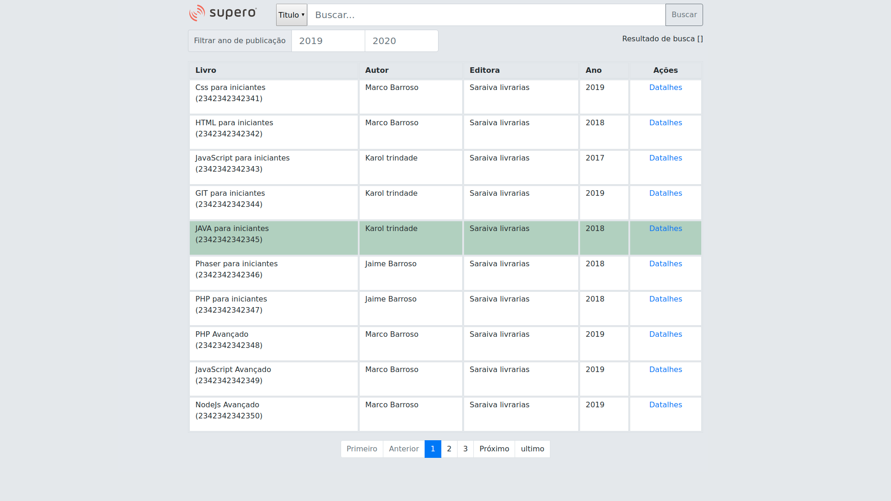

# AVALIAÇÃO SUPERO - Sitema para busca de livros.

## Possibilita usuário realizar consulta de livros.

<a href="https://book-control.herokuapp.com"></a>


## Acesso ao sistema.
(https://xxxx.herokuapp.com)


## GitHub do Backend  em NodeJs.
https://github.com/marcobneves/avalicao-supero-api-nodejs


## Metodos disponíveis

```
GET, POST, FILTER, DELETE, PUT
```

## Tecnologias.

* [ReactJS](https://reactjs.org/)
  * Uma biblioteca JavaScript para criar interfaces de usuário.

* [Redux](https://redux.js.org)
  * Um contêiner de estado previsível para aplicativos JavaScript.

* [NodeJS](https://nodejs.org)
  * Criação do backend.

* [ExpressJS](http://expressjs.com/)
  * Criação da API Rest.

* [MongoDB Atlas](https://www.mongodb.com/)
  * Bando de dados não relacional.

* [Bootstrap](http://getbootstrap.com/)
  * Criação dos componentes e páginas.

## Versionamento, Deploy e Integração Contínua
* [Git](https://git-scm.com)
  * Versionamento
* [Heroku](https://www.heroku.com)
  * Deploy
